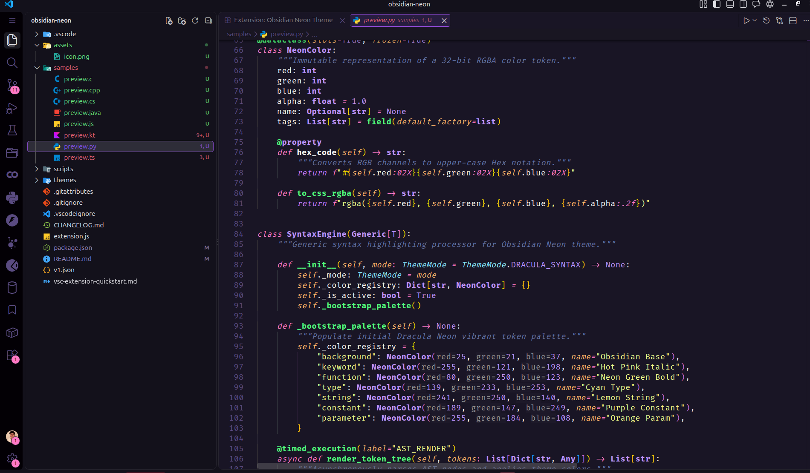
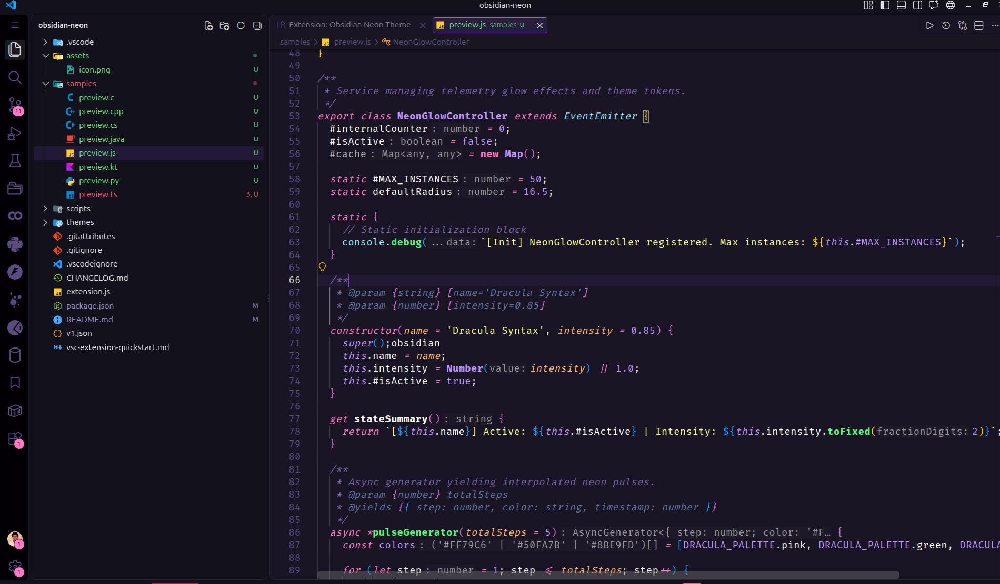
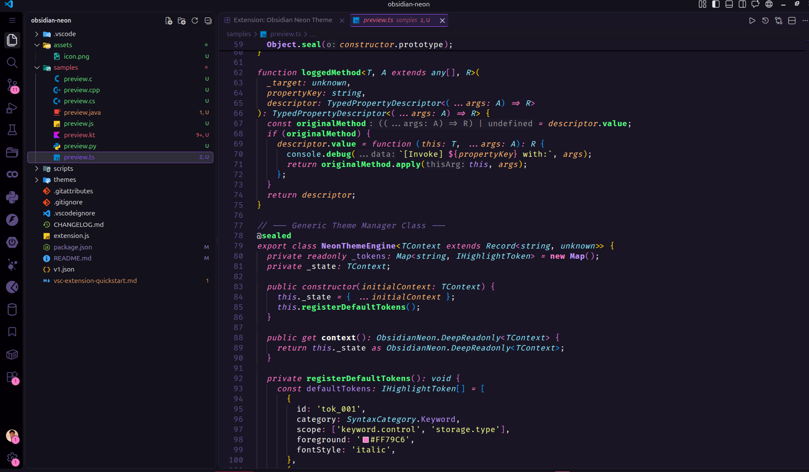
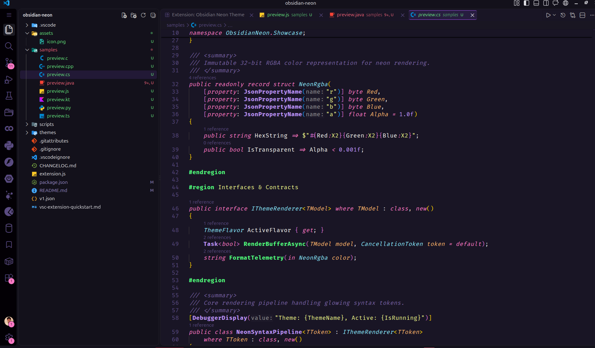
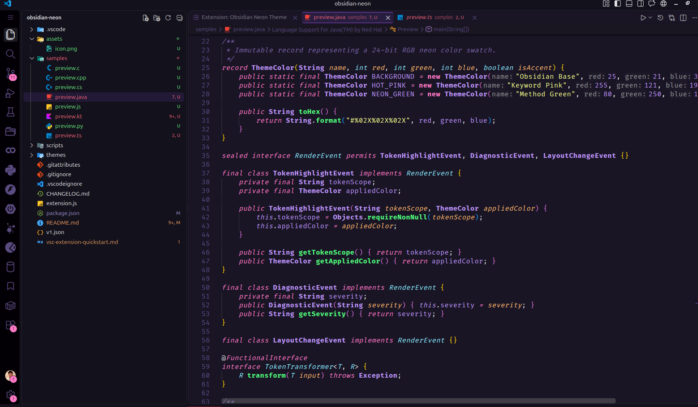
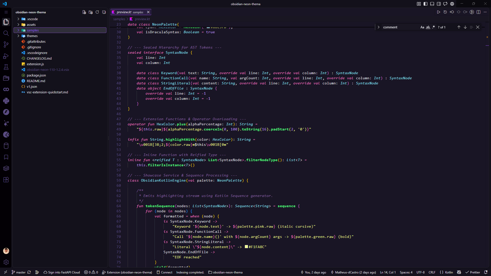
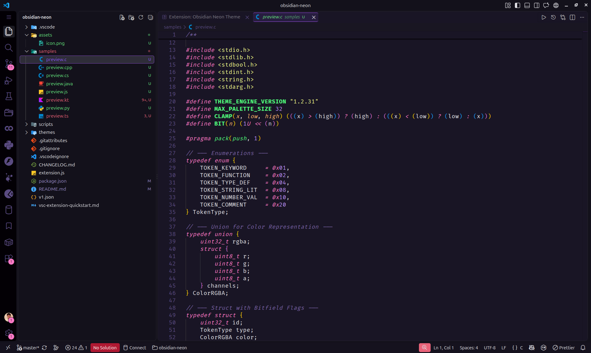
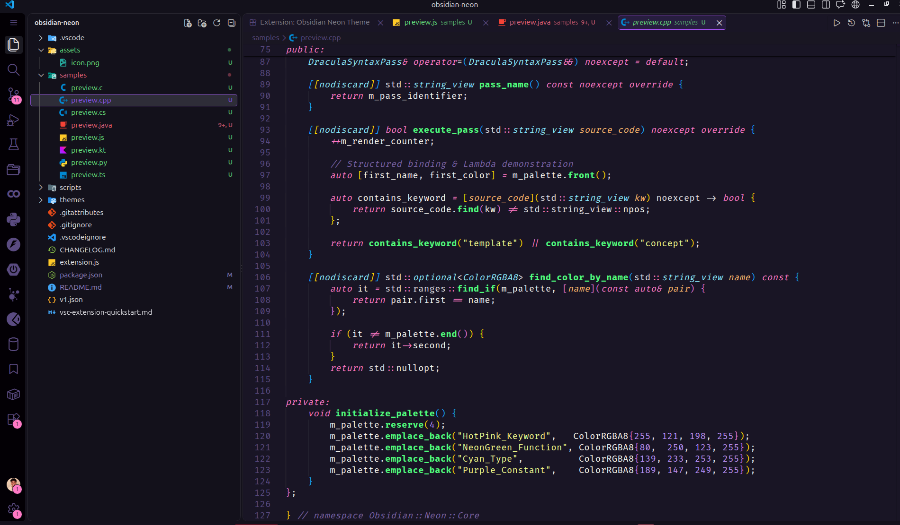

# 🌌 Obsidian Neon


[](https://marketplace.visualstudio.com/items?itemName=Alomyr.obsidian-neon)
[](https://github.com/Matheus-dCastro/obsidian-neon-thema)
[](https://matheusdecastro.com)

---

## 🎨 Themes Included

Obsidian Neon provides **3 theme variants**:

1. **Obsidian Neon (Default):** Omni-inspired deep obsidian canvas (`#191525`) combined with crisp neon syntax.
2. **Obsidian Neon (Dracula):** Dracula-infused dark aesthetics with high-contrast neon accents and purple glow.
3. **Obsidian Neon (Dracula Syntax):** Deep obsidian workbench paired with vibrant Dracula syntax colors.

---

## 📦 Extension Suite Features

* **3 Theme Flavors:** Tailored dark palettes built to reduce eye strain while keeping high contrast.
* **Custom Icon Pack:** Streamlined file and folder icons tuned specifically for the obsidian color system.
* **Error-Less Mode / Dimmed Diagnostics:** Refined inline diagnostic highlights that prevent aggressive visual noise from warnings and lint errors while coding.
* **Ghost Letters & Italic Accents:** Elegant cursive accents for keywords, storage modifiers, and comments.
* **Full Semantic Highlighting:** Dynamic token coloring across TypeScript, JavaScript, Python, C#, Java, C++, and Kotlin.

---

## 📸 Theme Previews

### 🐍 Python


---

### 🟨 JavaScript


---

### 🔷 TypeScript


---

### 💜 C# / .NET


---

### ☕ Java


---

### 🎯 Kotlin


---

### 🔵 C


---

### ⚙️ C++


---

## 🚀 Installation

1. Open **VS Code**.
2. Press `Ctrl + P` (or `Cmd + P` on macOS).
3. Run the installation command:

```text
ext install Alomyr.obsidian-neon

Press Ctrl + K, Ctrl + T to switch between Obsidian Neon, Obsidian Neon (Dracula), or Obsidian Neon (Dracula Syntax).
```
## 💡 Setting Up Inlay Hints by Language

Inlay hints show inline parameter names, inferred variable types, and return types directly inside your editor.

### 1. Enable Inlay Hints Globally
Open your settings.json (Ctrl + Shift + P -> Preferences: Open User Settings (JSON)):

    "editor.inlayHints.enabled": "on"

### 2. Language Specific Configurations

- Python: Requires the Pylance extension.
      
    "python.analysis.inlayHints.variableTypes": true,
    "python.analysis.inlayHints.functionReturnTypes": true,
    "python.analysis.inlayHints.callArgumentNames": "all",
    "python.analysis.inlayHints.pytestParameters": true,

- TypeScript / JavaScript:

    "typescript.inlayHints.parameterNames.enabled": "all",
    "typescript.inlayHints.variableTypes.enabled": true,
    "typescript.inlayHints.functionLikeReturnTypes.enabled": true,
    "javascript.inlayHints.parameterNames.enabled": "all",
    "javascript.inlayHints.variableTypes.enabled": true,
    "javascript.inlayHints.functionLikeReturnTypes.enabled": true,

- C# / .NET: Requires the C# / C# Dev Kit extension.

    "csharp.inlayHints.enableInlayHintsForTypes": true,
    "csharp.inlayHints.enableInlayHintsForImplicitVariableTypes": true,
    "csharp.inlayHints.enableInlayHintsForImplicitObjectCreation": true,
    "csharp.inlayHints.enableInlayHintsForLambdaParameterTypes": true,
    "dotnet.inlayHints.enableInlayHintsForParameters": true,
    "dotnet.inlayHints.enableInlayHintsForLiteralParameters": true,
    "dotnet.inlayHints.enableInlayHintsForObjectCreationParameters": true,

- C / C++: Requires the C/C++ (ms-vscode) extension.

    "C_Cpp.inlayHints.parameterNames.enabled": true,
    "C_Cpp.inlayHints.autoDeclarationTypes.enabled": true,
    "C_Cpp.inlayHints.referenceOperator": true,

- Java: Requires Language Support for Java by Red Hat.

    "java.inlayHints.variableTypes.enabled": true,
    "java.inlayHints.methodReturnTypes.enabled": true,
    "java.inlayHints.parameterNames.enabled": "all",

- Kotlin: Requires the Kotlin language server extension.

    "kotlin.inlayHints.typeHints": true,
    "kotlin.inlayHints.parameterHints": true,
    "kotlin.inlayHints.chainedHints": true,

## ⚙️ Full Recommended Configuration

Paste the following JSON block into your settings.json (Ctrl + Shift + P -> Preferences: Open User Settings (JSON)) for full editor tuning:

    {
      "workbench.colorTheme": "Obsidian Neon",
      "editor.fontFamily": "'Fira Code', 'Droid Sans Mono', monospace",
      "editor.fontLigatures": true,
      "editor.fontSize": 15,
      "editor.letterSpacing": 0.5,
      "editor.cursorBlinking": "expand",
      "editor.cursorSmoothCaretAnimation": "on",
      "editor.semanticHighlighting.enabled": true,
      "editor.bracketPairColorization.enabled": true,

      // Global Inlay Hints
      "editor.inlayHints.enabled": "on",

      // Python
      "python.analysis.inlayHints.functionReturnTypes": true,
      "python.analysis.inlayHints.variableTypes": true,
      "python.analysis.inlayHints.callArgumentNames": "all",
      "python.analysis.inlayHints.pytestParameters": true,
      "python.analysis.showOnlyDirectDependenciesInAutoImport": true,
      "python.analysis.autoImportCompletions": true,
      "[python]": {
        "editor.defaultFormatter": "ms-python.black-formatter"
      },

      // TypeScript & JavaScript
      "typescript.inlayHints.variableTypes.enabled": true,
      "typescript.inlayHints.functionLikeReturnTypes.enabled": true,
      "typescript.inlayHints.parameterNames.enabled": "all",
      "typescript.inlayHints.parameterTypes.enabled": true,
      "typescript.inlayHints.propertyDeclarationTypes.enabled": true,
      "typescript.inlayHints.enumMemberValues.enabled": true,
      "javascript.inlayHints.variableTypes.enabled": true,
      "javascript.inlayHints.functionLikeReturnTypes.enabled": true,
      "javascript.inlayHints.parameterNames.enabled": "all",
      "javascript.inlayHints.parameterTypes.enabled": true,
      "javascript.inlayHints.propertyDeclarationTypes.enabled": true,
      "javascript.inlayHints.enumMemberValues.enabled": true,

      // C# / .NET
      "csharp.inlayHints.enableInlayHintsForImplicitObjectCreation": true,
      "csharp.inlayHints.enableInlayHintsForImplicitVariableTypes": true,
      "csharp.inlayHints.enableInlayHintsForLambdaParameterTypes": true,
      "csharp.inlayHints.enableInlayHintsForTypes": true,
      "dotnet.inlayHints.enableInlayHintsForParameters": true,
      "dotnet.inlayHints.enableInlayHintsForIndexerParameters": true,
      "dotnet.inlayHints.enableInlayHintsForLiteralParameters": true,
      "dotnet.inlayHints.enableInlayHintsForObjectCreationParameters": true,
      "dotnet.inlayHints.enableInlayHintsForOtherParameters": true,

      // C / C++
      "C_Cpp.inlayHints.parameterNames.enabled": true,
      "C_Cpp.inlayHints.parameterNames.hideLeadingUnderscores": false,
      "C_Cpp.inlayHints.referenceOperator": true,
      "C_Cpp.inlayHints.autoDeclarationTypes.enabled": true,

      // Java
      "java.inlayHints.variableTypes.enabled": true,
      "java.inlayHints.methodReturnTypes.enabled": true,
      "java.inlayHints.parameterNames.enabled": "all",

      // Kotlin
      "kotlin.inlayHints.typeHints": true,
      "kotlin.inlayHints.parameterHints": true,
      "kotlin.inlayHints.chainedHints": true,

      // Terminal LSP Suggestions
      "terminal.integrated.suggest.enabled": true,
      "terminal.integrated.suggest.insertTrailingSpace": true,
      "terminal.integrated.suggest.providers": {
        "lsp": true
      },
      "terminal.integrated.suggest.suggestOnTriggerCharacters": true,
      "terminal.integrated.suggest.quickSuggestions": true
    }

# 👨‍💻 Author

Created and maintained by Matheus de Castro.

  Website: matheusdecastro.com

  GitHub: @Matheus-dCastro

  Project Repository: Matheus-dCastro/obsidian-neon-thema